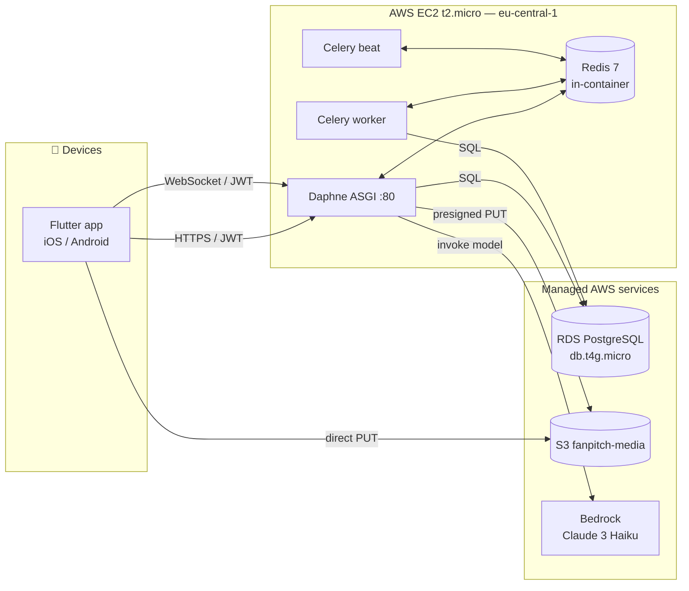

# FanPitch — Architecture

> **TL;DR**: a Django ASGI app (Daphne + Channels for WebSocket) talks to
> PostgreSQL + Redis in front of an S3 media store and a Bedrock LLM
> endpoint. A small Flutter mobile app speaks JWT-authenticated HTTP for
> CRUD and a WebSocket for live match events. One docker-compose stack
> on an EC2 t2.micro hosts everything except RDS and S3.

## High-level diagram



## Three core pillars (Challenge 3 requirements)

| Pillar | Surface in FanPitch | Implementation |
|---|---|---|
| **MULTIPLAYER** | Live match rooms, shared polls, shared reactions, shared leaderboard | WebSocket via `channels` (apps/realtime) + Redis channel layer; reactions/polls broadcast to all viewers of the match group |
| **REAL-TIME DATA** | Match-event ticker (goals, cards, half-time, full-time) reactive UI | `apps/matches/services/simulator.py` replays a scripted Bundesliga match through MatchEvent inserts; signals broadcast to consumers; clients consume via `MatchSocket` |
| **GAMIFICATION** | Points, badges, leaderboard, predictions scoring, streaks | `apps/gamification` (Badge, UserBadge, PointsEvent); Celery task `score_match_predictions` fires on FULLTIME signal |

## Apps map (Django INSTALLED_APPS, `apps.*`)

```
apps/
├── accounts/        User, Profile (display_name, avatar, country, points, level), Follow, JWT auth
├── matches/         Team, Match, MatchEvent, simulator, demo-fan bots, Football-Data optional adapter
├── feed/            Status (7-day TTL), MediaPost, S3 presigned uploads, ranker (for-you), impressions
├── interactions/    Reaction (multi-target), Prediction, Poll, PollVote, Comment
├── gamification/    Badge, UserBadge, PointsEvent, leaderboard, badge rules
├── ai/              Bedrock client + offline fallback + BedrockCall cost tracking
└── realtime/        Channels consumers + JWT WS middleware
```

## Request flow examples

### Sending a reaction during a live match

```
Phone (Flutter)                EC2 web (Daphne)              Redis              DB
     │                              │                          │                 │
     │  WS message:                 │                          │                 │
     │  {type:"reaction.send",       │                          │                 │
     │   target_type:"MATCH_EVENT", │                          │                 │
     │   target_id:42,              │                          │                 │
     │   emoji:"🔥"}                │                          │                 │
     ├─────────────────────────────►│                          │                 │
     │                              │  Reaction.objects.create │                 │
     │                              ├─────────────────────────────────────────►│
     │                              │  Channel group_send to   │                 │
     │                              │  match.<id> group        │                 │
     │                              ├─────────────────────────►│                 │
     │                              │                          │                 │
     │  WS broadcast to all viewers │                          │                 │
     │◄─────────────────────────────┤◄─────────────────────────┤                 │
```

### Posting a status with a photo

```
Phone                  EC2 web                         S3            DB
  │                       │                              │             │
  │ POST /media/upload-url│                              │             │
  ├──────────────────────►│                              │             │
  │                       │ generate_presigned_put       │             │
  │                       ├─────────────────────────────►│             │
  │                       │◄─────────────────────────────┤             │
  │  presigned URL        │                              │             │
  │◄──────────────────────┤                              │             │
  │  PUT bytes directly   │                              │             │
  ├──────────────────────────────────────────────────────►             │
  │  POST /media/ (s3_key,│                              │             │
  │   media_type)         │                              │             │
  ├──────────────────────►│  MediaPost.objects.create()  │             │
  │                       ├─────────────────────────────────────────►│
  │  POST /statuses/      │                              │             │
  │   (media_id, body)    │                              │             │
  ├──────────────────────►│  Status.objects.create()     │             │
  │                       ├─────────────────────────────────────────►│
  │  Status DTO           │                              │             │
  │◄──────────────────────┤                              │             │
```

## Data model — key relationships

```
User ──1──┐
          ├── Profile (display_name, avatar, country, points, level)
          ├── Follow (→ followee)
          ├── Status (body, media, team, expires_at) ──N── Reaction, Comment, Impression
          ├── Prediction (→ Match, home_score, away_score, points_awarded)
          ├── UserBadge (→ Badge)
          └── PointsEvent (source, delta)

Team ──┐
       ├── Match (home, away, kickoff_at, status, scores)
       │     └── MatchEvent (minute, type, team, player, payload)
       └── Profile.favorite_team

Match ──┬── Prediction
        ├── MatchEvent
        └── Poll ── PollVote
```

## Deployment topology (AWS Innovation Sandbox)

| Resource | Type | Purpose |
|---|---|---|
| `i-0dce4a4ab...` | EC2 t2.micro | Hosts `docker-compose.prod.yml` (web + worker + beat + redis) |
| `fanpitch-db` | RDS PostgreSQL db.t4g.micro | Persistent app data |
| `fanpitch-media-<acct>` | S3 bucket | User-uploaded media, presigned PUTs from mobile |
| `FanPitchAppRole` | IAM role + instance profile | Lets the EC2 read/write S3 and invoke Bedrock without baked-in credentials |
| `fanpitch-sg` | Security group | Open 22/80/443/8000 to world, 5432 SG-internal |
| `fanpitch-db-subnets` | DB subnet group | Default-VPC subnets in all 3 AZ of eu-central-1 |

Provisioning: `deploy/setup_aws_sandbox.sh` (idempotent, ~10 min). See
[`deploy/README.md`](deploy/README.md).

## Why these choices

| Decision | Alternative considered | Why we picked this |
|---|---|---|
| **Django monolith** | Lambda + DynamoDB | Easier to demo end-to-end in 3 min; existing Django ecosystem (ORM, admin, drf-spectacular) saves hackathon time. |
| **Daphne + Channels** | API Gateway WebSocket + Lambda | One process for HTTP + WS = one container to deploy; Channels groups model maps cleanly to "match rooms". |
| **Redis in-container** | ElastiCache | ISB sandbox does not confirm ElastiCache; running Redis in the same compose costs $0 vs ~$13/mo. |
| **PostgreSQL on RDS** | RDS Aurora | t4g.micro is Free-Tier-friendly; Aurora is overkill for a hackathon DB load. |
| **EC2 t2.micro single-instance** | ECS Fargate | Avoids the 30-min container-cold-start fight and the load-balancer cost; the 3-min demo doesn't need horizontal scale. |
| **Bedrock Claude 3 Haiku** | OpenAI / self-hosted Llama | AWS-native (judges value this), pay-per-token (~$0.0003 each), fast (sub-second). |
| **rsync deploy (not git clone on EC2)** | GitHub Actions auto-deploy | Sandbox credentials rotate every 4h, breaking long-lived deploy secrets. Manual rsync from laptop is reliable. |

## Future work (post-hackathon)

- Replace EC2 + RDS with ECS Fargate + RDS Aurora Serverless for true scale.
- Move WebSocket fan-out behind API Gateway WebSocket APIs to drop the
  per-connection EC2 RAM cost.
- Add CloudFront in front of S3 for global media delivery.
- Migrate to Cognito-issued JWTs to enable social login (Google/Apple).
- Add Kinesis Data Streams for real-time match-event ingestion from a
  professional feed provider (replace the local simulator).
